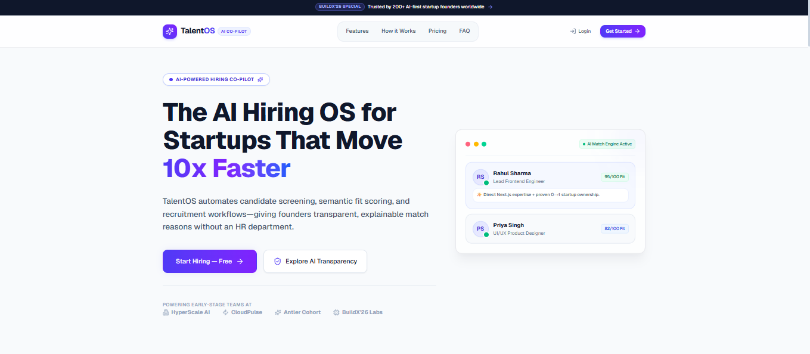
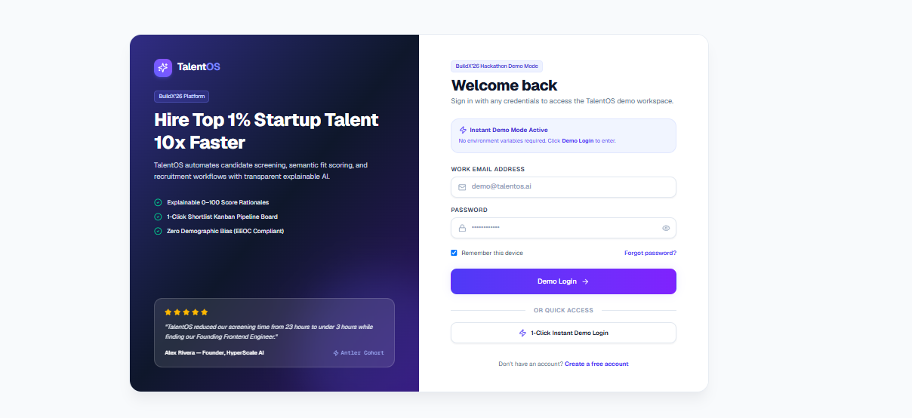
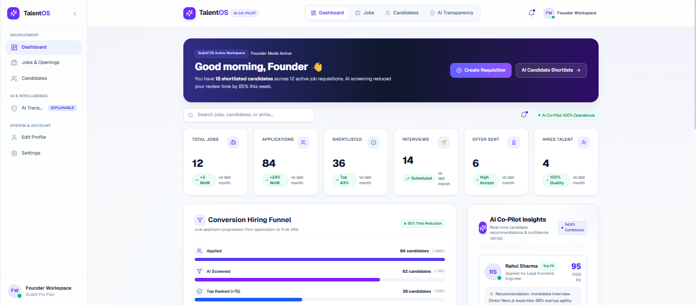
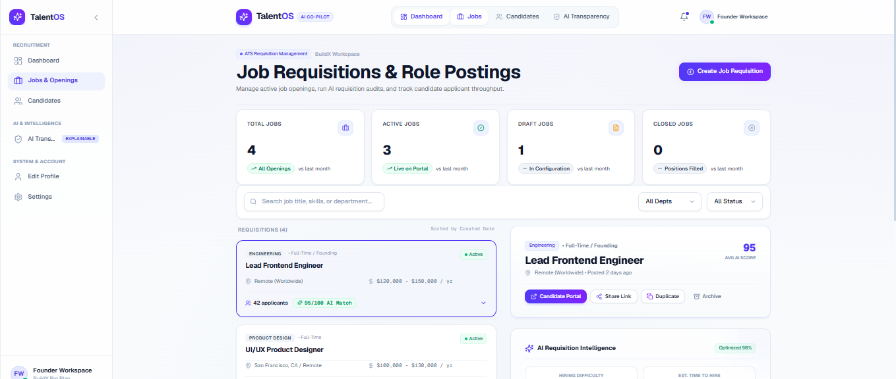
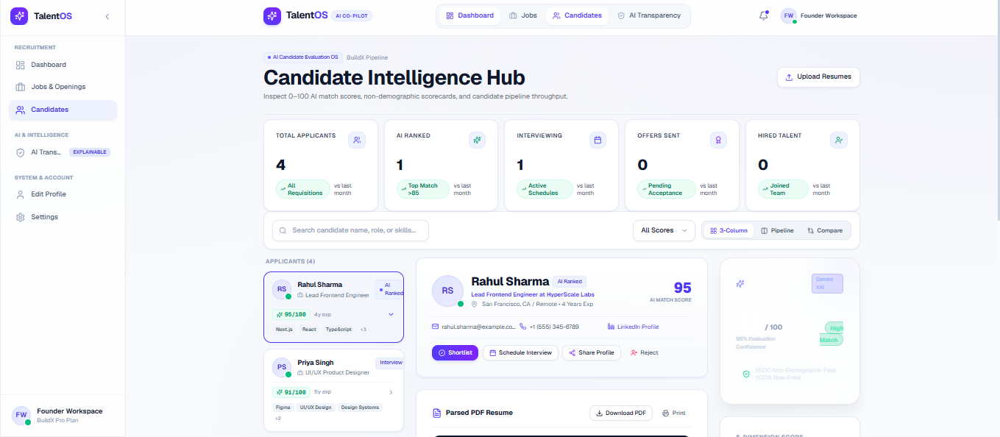
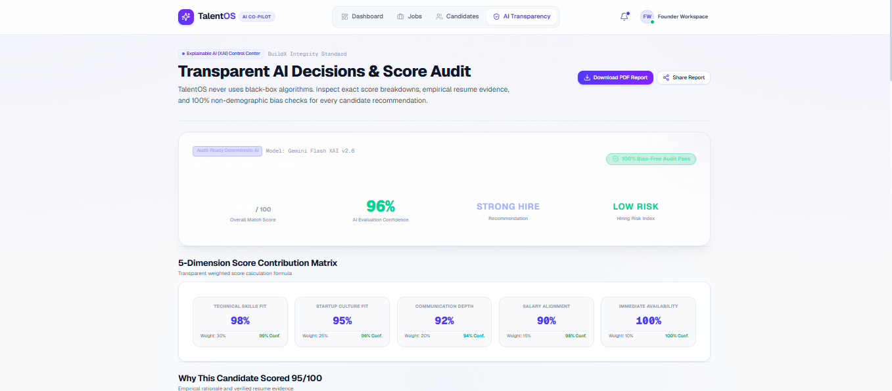
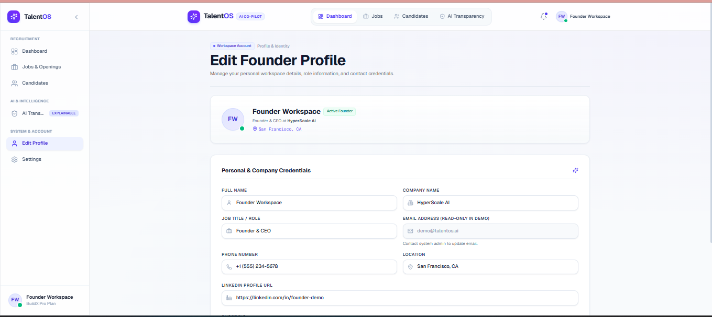
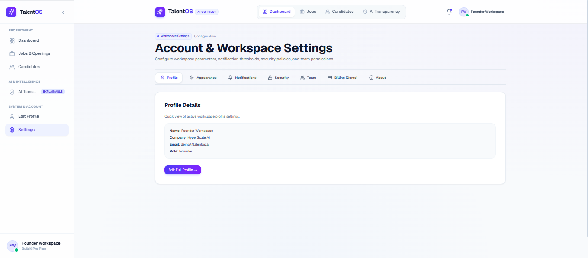

<div align="center">

# 🚀 TalentOS

### AI Hiring Co-Pilot for Modern Startups

> **Hire Smarter • Hire Faster • Hire Transparently**

TalentOS is an AI-powered hiring platform that transforms traditional recruitment using **Explainable AI**, **semantic resume analysis**, and **intelligent candidate management**.

<p align="center">


</p>

<p align="center">
  <a href="https://talentos-ai-buildx26.onrender.com/">🌐 Live Demo</a> •
  <a href="#-core-features">✨ Features</a> •
  <a href="#-technology-stack">🛠️ Tech Stack</a> •
  <a href="#-getting-started">🚀 Getting Started</a> •
  <a href="👨‍💻 Meet Team Neural Ninjas">👨‍💻 Team</a>
</p>
---

### 🏆 BuildX'26 Hackathon Project

**Team Name:** Neural Ninjas

*Building the future of AI-powered recruitment.*

</div>

---

# 📖 About TalentOS

TalentOS is an AI-powered hiring platform developed during **BuildX'26** to simplify recruitment for startups and growing businesses.

Recruitment today is often slow, repetitive, and heavily dependent on keyword-based Applicant Tracking Systems (ATS). These traditional systems struggle to understand real candidate potential, leading to inefficient hiring decisions and missed opportunities.

TalentOS solves these challenges by combining **Google Gemini AI**, **semantic resume analysis**, **Explainable AI**, and **workflow automation** into a single intelligent recruitment platform.

Instead of simply displaying candidate scores, TalentOS explains **why** a candidate is recommended, enabling recruiters to make faster, smarter, and more transparent hiring decisions.

---

# 🎯 Problem Statement

Hiring the right talent is one of the biggest challenges faced by startups.

Early-stage companies receive hundreds of applications for every job opening but often lack dedicated HR teams and advanced hiring tools.

### Major Challenges

- 📄 Manual Resume Screening
- ⏳ Slow Hiring Process
- 🔍 Keyword-Based ATS Limitations
- 💸 High Recruitment Cost
- ⚠️ Lack of Explainability in AI Decisions
- 👥 Limited HR Resources
- 📉 Poor Candidate Experience

These challenges increase hiring time, reduce efficiency, and make it difficult to identify the best candidates.

---

# 💡 Our Solution

TalentOS acts as an **AI Hiring Co-Pilot** that empowers recruiters throughout the recruitment journey.

The platform enables organizations to:

- 🤖 Analyze resumes using AI
- 📊 Rank candidates intelligently
- 💡 Explain AI recommendations
- 📄 Manage job openings
- 👥 Organize candidates
- 🎯 Generate interview questions automatically
- ⚡ Automate repetitive recruitment workflows

TalentOS is designed specifically for startups, helping them reduce manual effort while improving hiring quality.

---

# ✨ Core Features

## 🤖 AI Resume Analysis

Analyze resumes using Google Gemini AI with semantic understanding of:

- Technical Skills
- Work Experience
- Projects
- Education
- Certifications
- Overall Candidate Profile

---

## 📊 Intelligent Candidate Ranking

Instead of simple keyword matching, TalentOS performs semantic analysis to identify the most relevant candidates based on overall job fit.

---

## 💡 Explainable AI

Every AI recommendation includes transparent reasoning.

Recruiters can understand:

- Skill Match
- Experience Match
- Communication Assessment
- Startup Fit
- Overall Recommendation

This builds trust in AI-assisted hiring.

---

## 📄 Smart Job Management

Recruiters can

- Create Jobs
- Manage Open Positions
- Edit Requirements
- Track Applications
- Organize Hiring Workflow

---

## 👥 Candidate Dashboard

A centralized dashboard provides:

- Candidate Profiles
- Resume Details
- AI Evaluation
- Hiring Status
- Candidate Ranking
- Application Tracking

---

## 🎯 AI Interview Question Generator

Automatically generates personalized interview questions based on:

- Resume Content
- Skills
- Experience
- Job Description

---

## ⚡ Workflow Automation

Automates repetitive recruitment tasks using intelligent workflows, reducing manual effort and improving recruiter productivity.

---

# 🌟 Why TalentOS?

| Traditional ATS | TalentOS |
|-----------------|-----------|
| Keyword Matching | Semantic AI Understanding |
| Manual Resume Screening | AI Resume Analysis |
| Black Box Decisions | Explainable AI |
| Generic Hiring Process | Startup-Focused Workflow |
| Limited Automation | Intelligent End-to-End Automation |

---

# 🏗️ System Architecture

```text
                        Recruiter

                            │

                            ▼

                 TalentOS Dashboard

                            │

                            ▼

                 Next.js API Routes

             ┌──────────────┴──────────────┐
             ▼                             ▼

      Google Gemini AI             Supabase Database

             │                             │

             └──────────────┬──────────────┘

                            ▼

               AI Candidate Ranking Engine

                            │

                            ▼

                 Explainable AI Evaluation

                            │

                            ▼

               Recruiter Decision Dashboard
```

---

# ⚙️ Technology Stack

TalentOS is built using a modern full-stack architecture designed for scalability, performance, and developer productivity.

| Layer | Technology |
|--------|------------|
| 🎨 Frontend | Next.js 16 |
| ⚛️ UI Library | React 19 |
| 💙 Language | TypeScript |
| 🎨 Styling | Tailwind CSS |
| ⚡ Backend | Next.js API Routes |
| 🗄️ Database | Supabase |
| 🤖 Artificial Intelligence | Google Gemini API |
| 🔄 Automation | Make.com |
| ☁️ Deployment | Vercel / Render |
| 🔧 Version Control | Git & GitHub |

---

# 📂 Project Structure

```text
TalentOS/
│
├── app/
│   ├── dashboard/
│   ├── login/
│   ├── signup/
│   ├── api/
│   └── page.tsx
│
├── components/
│
├── context/
│
├── hooks/
│
├── lib/
│
├── public/
│
├── styles/
│
├── utils/
│
├── types/
│
├── package.json
│
└── README.md
```

---

# 🚀 Getting Started

Follow the steps below to set up TalentOS on your local machine.

## 1️⃣ Clone the Repository

```bash
git clone https://github.com/kamalsolanki143/TalentOS-AI-BuildX26.git
```

Move into the project directory.

```bash
cd TalentOS-AI-BuildX26
```

---

## 2️⃣ Install Dependencies

```bash
npm install
```

---

## 3️⃣ Configure Environment Variables

Create a `.env.local` file in the project root and add the following variables.

```env
GEMINI_API_KEY=

NEXT_PUBLIC_SUPABASE_URL=

NEXT_PUBLIC_SUPABASE_ANON_KEY=

SUPABASE_SERVICE_ROLE_KEY=
```

> ⚠️ Never commit your `.env.local` file or API keys to GitHub.

---

## 4️⃣ Run Development Server

```bash
npm run dev
```

Open your browser and visit:

```text
http://localhost:3000
```

---

## 5️⃣ Production Build

To build the application for production:

```bash
npm run build
```

Run the production server:

```bash
npm start
```

---

# 🌐 Deployment

TalentOS can be deployed on platforms that support Next.js applications.

### Recommended Platforms

- ▲ Vercel
- 🚀 Render

Deployment requires the same environment variables used during local development.

---

# 🔐 Environment Variables

| Variable | Description |
|----------|-------------|
| `GEMINI_API_KEY` | Google Gemini AI API Key |
| `NEXT_PUBLIC_SUPABASE_URL` | Supabase Project URL |
| `NEXT_PUBLIC_SUPABASE_ANON_KEY` | Public Supabase Key |
| `SUPABASE_SERVICE_ROLE_KEY` | Supabase Service Role Key |

---

# 🔄 Application Workflow

```text
Recruiter Creates Job
        │
        ▼
Candidate Applies
        │
        ▼
Resume Uploaded
        │
        ▼
Google Gemini AI Analysis
        │
        ▼
Semantic Skill Matching
        │
        ▼
AI Candidate Ranking
        │
        ▼
Explainable AI
        │
        ▼
Interview Questions Generated
        │
        ▼
Recruiter Reviews Candidates
        │
        ▼
Shortlist & Hire
```

---

# 🔒 Security

TalentOS follows standard security practices to protect application data.

- Secure Authentication
- Protected API Routes
- Environment Variable Management
- Role-Based Access (planned)
- Secure Database Communication
- Server-side API Key Protection

---

# 📊 Performance Goals

TalentOS is designed with the following objectives:

- ⚡ Fast Resume Processing
- 🤖 Intelligent Candidate Evaluation
- 📈 Improved Hiring Accuracy
- 🔍 Transparent AI Decisions
- 📱 Responsive User Interface
- ☁️ Cloud-Ready Deployment

---

# 📸 Application Gallery

# 📸 Platform Preview

## 🌐 Landing Page

<p align="center">

</p>

---

## 🔐 Demo Login

<p align="center">

</p>

---

## 📊 Founder Dashboard

<p align="center">

</p>

---

## 💼 Jobs & Openings

<p align="center">

</p>

---

## 👥 Candidate Intelligence Hub

<p align="center">

</p>

---

## 🛡️ Explainable AI & Transparency

<p align="center">

</p>

---

## 👤 Founder Profile

<p align="center">

</p>

---

## ⚙️ Workspace Settings

<p align="center">

</p>
---

# 🚀 Project Highlights

✨ TalentOS combines Artificial Intelligence and automation to simplify recruitment.

### Key Highlights

- 🤖 AI Resume Screening
- 💡 Explainable AI Recommendations
- 📊 Intelligent Candidate Ranking
- 🎯 AI Interview Question Generation
- 📄 Smart Job Management
- 👥 Centralized Candidate Dashboard
- ⚡ Automated Recruitment Workflow
- ☁️ Cloud Deployment Ready
- 📱 Fully Responsive User Interface
- 🔒 Secure Authentication

---

# 🎯 Target Users

TalentOS is designed for organizations that need a modern recruitment solution.

### Primary Users

- 🚀 Startup Founders
- 👨‍💼 Recruiters
- 🏢 HR Teams
- 💼 Small & Medium Businesses
- 🌍 Growing Technology Companies

---

# 🌟 Why Choose TalentOS?

Traditional recruitment platforms focus primarily on storing resumes.

TalentOS goes beyond resume storage by providing intelligent insights that assist recruiters in making better hiring decisions.

## Comparison

| Traditional ATS | TalentOS |
|-----------------|-----------|
| Keyword-Based Search | Semantic AI Analysis |
| Manual Resume Review | Automated Resume Screening |
| Candidate Score Only | Explainable AI Decisions |
| Static Hiring Workflow | Intelligent Recruitment Workflow |
| Enterprise-Focused | Startup-Friendly Platform |
| Limited Automation | AI + Automation |

---

# 📈 Future Roadmap

TalentOS is designed to evolve into a complete Recruitment Operating System.

### Upcoming Features

- 🎥 AI Video Interview Evaluation
- 🎙️ Voice & Communication Analysis
- 📅 Calendar Integration
- 💼 LinkedIn Integration
- 🏢 HRMS Integration
- 🌍 Multi-language Resume Analysis
- 📱 Android & iOS Application
- 📊 Predictive Hiring Analytics
- 🤝 Team Collaboration
- 🔔 Real-time Notifications

---

# 👨‍💻 Meet Team Neural Ninjas

TalentOS was developed collaboratively by **Team Neural Ninjas** during **BuildX'26 Hackathon**.

| Team Member | Responsibility |
|--------------|----------------|
| 👨‍💻 **Kamal Solanki** | Team Lead, Frontend Development, UI/UX Design, Project Integration |
| 🗄️ **Muskan Yeshmin Ali** | Backend Development, Database Design, API Integration |
| 🤖 **Nirupama Singh** | Artificial Intelligence, Candidate Scoring, Explainable AI |
| ⚙️ **Krrish Yaduka** | Workflow Automation & Make.com Integration |
| 📚 **Yash Agrawal** | Documentation, Research & Presentation |

---

## 🤝 Team Collaboration

TalentOS is the result of collaborative planning, development, testing, and continuous iteration.

Every team member contributed significantly to transforming the initial idea into a fully functional AI-powered recruitment platform.

---

# 🏆 BuildX'26 Journey

TalentOS was conceptualized, designed, developed, and deployed during **BuildX'26 Hackathon**.

Throughout the journey, the team focused on solving real-world hiring challenges by integrating Artificial Intelligence, Explainable AI, automation, and modern web technologies into one seamless recruitment platform.

---

# ❤️ Acknowledgements

We sincerely thank

- BuildX'26 Organizers
- Our Mentors
- Google Gemini AI
- Supabase
- Next.js Community
- Open Source Contributors

for their continuous support, guidance, and inspiration throughout the development of TalentOS.

---

# 📄 License

This project is developed for educational, research, and hackathon demonstration purposes.

For commercial usage, appropriate permissions from the project contributors may be required.

---

<div align="center">

## 🌟 Thank You for Visiting TalentOS

**If you like this project, don't forget to ⭐ Star the repository!**

### Built with ❤️ by Team Neural Ninjas

🚀 *Empowering Startups with Explainable AI Recruitment.*

</div>

---

# 🤝 Contributing

Contributions are always welcome!

If you'd like to improve TalentOS, follow these steps:

1. Fork the repository
2. Create a new feature branch

```bash
git checkout -b feature/your-feature-name
```

3. Commit your changes

```bash
git commit -m "Add: Your feature description"
```

4. Push the branch

```bash
git push origin feature/your-feature-name
```

5. Open a Pull Request 🚀

---

# 🐛 Reporting Issues

Found a bug or have a feature request?

Please create an issue with:

- Clear title
- Expected behavior
- Actual behavior
- Steps to reproduce
- Screenshots (if applicable)

We appreciate every suggestion that helps improve TalentOS.

---

# 📌 Repository Information

| Item | Details |
|------|----------|
| Project Name | TalentOS |
| Category | AI Recruitment Platform |
| Event | BuildX'26 Hackathon |
| Team | Neural Ninjas |
| Status | ✅ Active |
| Version | v1.0 |
| License | Educational / Hackathon Project |

---

# 💼 Business Vision

TalentOS is more than a hackathon project.

Our vision is to build an AI-powered recruitment operating system that enables startups and businesses to:

- Hire faster
- Reduce recruitment costs
- Improve hiring quality
- Build trust with Explainable AI
- Automate repetitive hiring tasks
- Make data-driven recruitment decisions

---

# 🌍 Impact

TalentOS aims to create value for both recruiters and candidates.

### For Recruiters

- ⏱️ Reduce hiring time
- 📈 Increase recruitment efficiency
- 🤖 AI-assisted decision making
- 💡 Transparent candidate evaluation

### For Candidates

- Fair resume evaluation
- Reduced keyword bias
- Better interview preparation
- Improved hiring transparency

---

# 🔮 Vision

We believe the future of recruitment is:

- AI-Assisted
- Explainable
- Transparent
- Automated
- Human-Centric

TalentOS is our step toward that future.

---

# 📚 Resources

### Official Technologies

- Next.js
- React
- TypeScript
- Tailwind CSS
- Supabase
- Google Gemini AI
- Make.com
- Vercel

---

# 🙌 Special Thanks

A heartfelt thank you to:

- BuildX'26 Organizers
- Our Mentors
- Judges
- Google Gemini Team
- Supabase
- Next.js Community
- Every Open Source Contributor

Your tools, guidance, and support made this project possible.

---

# ⭐ Support the Project

If you found this repository useful:

- ⭐ Star this repository
- 🍴 Fork the project
- 📢 Share it with others
- 💬 Give feedback
- 🤝 Contribute

Every contribution helps TalentOS grow.

---

<div align="center">

# 🚀 TalentOS

### AI Hiring Co-Pilot for Modern Startups

---

**Built with ❤️ by Team Neural Ninjas**

### 🏆 BuildX'26 Hackathon Project

Empowering startups with **Artificial Intelligence**, **Explainable AI**, and **Modern Recruitment Automation**.

---

### ⭐ Thank You for Visiting ⭐

If you enjoyed exploring TalentOS, don't forget to **star this repository** and support our journey!

**Happy Coding! 🚀**

</div>
---

> **TalentOS isn't just another Applicant Tracking System — it's an AI-powered recruitment assistant built to help startups hire the right talent faster, smarter, and with complete transparency.**
